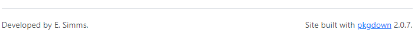
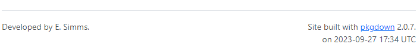
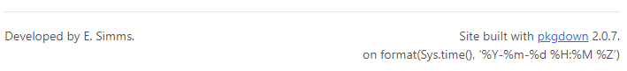
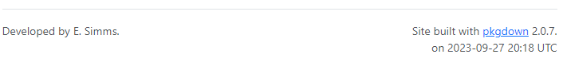

```{r, include = FALSE}
knitr::opts_chunk$set(
  collapse = TRUE,
  comment = "#>"
)
```

```{r setup, echo=FALSE}
library(ericstrava)
```


#### Note: I am hoping there is a much easier way to do this! Please let me know!

#### Note: I am doing this on the public GitHub; I have not yet tried it on GHEC.

<br>
The default footer produced with `pkgdown::build_site()` looks like this:
<br><br>

{width=100%}

<br>
I would like to also display the date when the site was last modified:
<br><br>

{width=100%}

<br>
I expected that pkgdown would have this available, but I have not been successful in finding anything on this. When it comes to having dates visible on package-related documentation, I did find this in [R Packages: Chapter 17.2](https://r-pkgs.org/vignettes.html#metadata) which mentions the yaml for a vignette:

> date: we think this usually does more harm than good, since it’s not clear what the date is meant to convey. Is it the last time the vignette source was updated? In that case you’ll have to manage it manually and it’s easy to forget to update it. If you manage date programmatically with Sys.date(), the date reflects when the vignette was built, i.e. when the package bundle was created, which has nothing to do with when the vignette or package was last modified. We’ve decided it’s best to omit the date.

<br>
I think it is worthwhile to automatically display the date when the entire site was last built, and to do so in a manner which makes it obvious we are talking about the entire package. This is useful information, which should be readily available, for developers and users. Once in production, the reason(s) for modification can be mentioned in the NEWS.md file. 

<br>
The solution I have found involves the following:

  * modifying _pkgdown.yml
  * setting the yaml.eval.expr option
  * modifying the github workflow

<br>

__Modifying \_pkgdown.yml__

<br>
According to the [pkgdown documentation](https://pkgdown.r-lib.org/reference/build_site.html#footer), there are three pre-defined components available for the `footer` block: 

  * `developed_by`, a sentence describing the main authors of the package
  * `built_with`, a sentence advertising pkgdown
  * `package`, the name of the package.

and the default structure makes use of two of them:

```
footer:
  structure: 
    left: developed_by
    right: built_with
```

Unfortunately, something like build_date is not available.

We can create our own components and these can be text or R expressions. In my _pkgdown.yml, I have defined two components and then specified, in the structure, where I want these components to appear:

```
footer:
  structure:
    left: developed_by
    right: [built_with, built_text, built_date]
  components:
    built_date: !expr "format(Sys.time(), '%Y-%m-%d %H:%M %Z')"
    built_text: "<br>on "
```

Running `pkgdown::build_site()` produces the following footer:

<br>
{width=100%}

<br>
__yaml.eval.expr__
<br><br>

By default, the ability to run R expressions in the _pkgdown.yml file is turned off. This is done for security reasons because an entire file of R statements could be pulled in and executed without the user being aware of it. 

<br>
We can permit the evaluation of the R expression with `options(yaml.eval.expr = TRUE)`. Running this in the console and then `pkgdown::build_site()` results in the date expression being evaluated:

<br>
{width=100%}

<br>
We can automate the setting of this option by defining an `.onLoad` function, which is automatically run every time we load our package with `devtools::load_all()`. I have also attempted to be polite by capturing the original setting of the `yaml.eval.expr` option and setting it back to this value when the package is unloaded:

```
.onLoad <- function(libname, pkgname) {
  # Save current setting for option yaml.eval.expr
  yaml_eval_expr <<- getOption("yaml.eval.expr")

  # Set to TRUE so the R code in _pkgdown.yml can be evaluated
  options(yaml.eval.expr = TRUE)
}

.onUnload <- function(libname, pkgname) {
  # Reset to the setting before ericstrava was loaded
  options(yaml.eval.expr = yaml_eval_expr)
}
```

#### Note: I have no idea what triggers .onUnload ... if someone can let me know, I would appreciate it.


<br>
My understanding is it is considered "standard" to store such code in `R/zzz.R`. Those `zzz`'s are not a placeholder; this is what I have found in my research. I am hoping that I have been the victim of a prank or outdated documentation about this.

<br>
__Modifying the GitHub Workflow__
<br><br>

I had been making use of a workflow to automatically create the pkgdown site when a PR is accepted into my main branch on GitHub. In order to have the date appear in the footnote, I needed to add a line to set the `yaml.eval.expr` option in the `.github/workflows/pkgdown.yaml` file:

```
- name: Build site
  run: |
    options(yaml.eval.expr=TRUE)
    pkgdown::build_site_github_pages(new_process = FALSE, install = FALSE)
```

<br>
__Request for Feedback__
<br><br>
I am interested in your comments on this!

